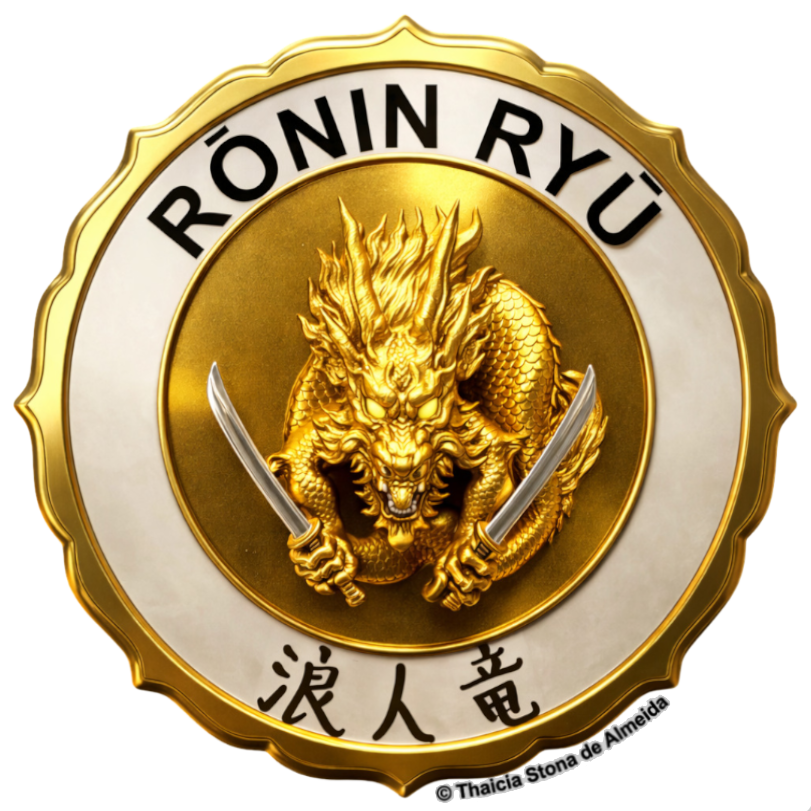
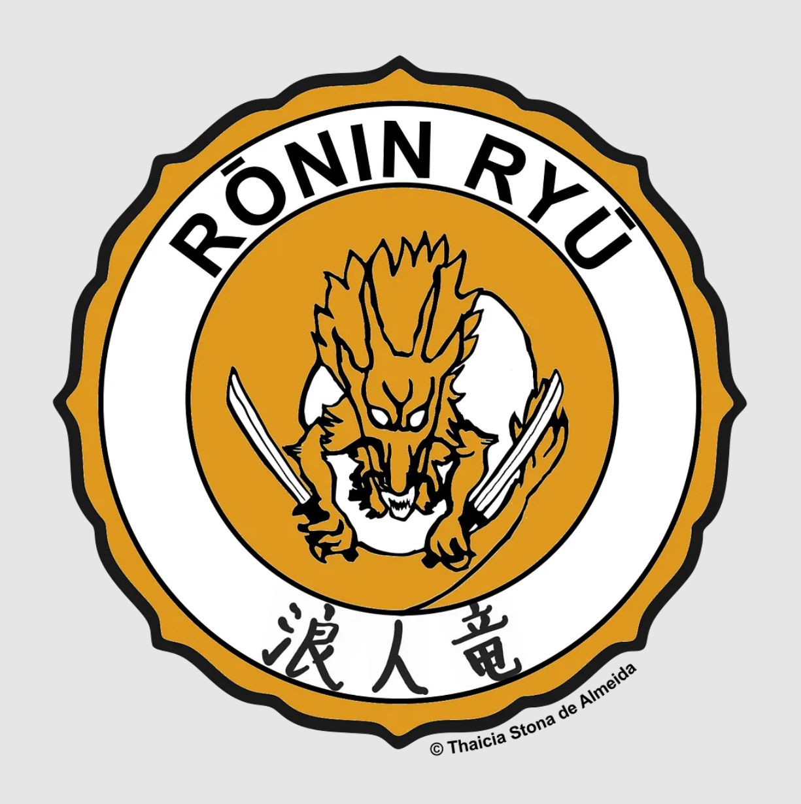

# R³P: Rōnin-Ryū Research Protoinstitute

## RŌNIN-RYŪ
<strong>

[ro·nin] /ˈrōnən/ : Samurai without a master

[ry·u] / rēˈo͞o/ : Dragon; Way, discipline
</strong>

## Origins
The <strong>Rōnin Ryū Research Protoinstitute (R³P)</strong> is a proto-research institute dedicated to independent multidisciplinary scholarship. Constituted in April 2024 as Rōnin Ryū Research Initiative, it was inspired by the model and mission of the original [Ronin Institute](https://web.archive.org/web/20240430102250/https://ronininstitute.org/) for Independent Scholarship (2012–2024). As a distinct entity, R³P represents an independent pathway for research, separate from the member-cooperative [RIIS 2.0](https://ronininstitute.org/), founded in April 2025. R³P evolved December 2025 to the status of proto-institution.

## Affiliated Members
Updated December, 2025
- **Dr. Thaicia Stona de Almeida**, Founder, Researcher [🎓](https://scholar.google.com/citations?view_op=list_works&hl=en&hl=en&user=2RSlU2AAAAAJ&pagesize=80&sortby=pubdate)
- **Dr. Mona Wells**, Researcher [🎓](https://scholar.google.com/citations?hl=en&user=lFkUO-0AAAAJ&view_op=list_works&sortby=pubdate)
  
## Timeline
- **Apr 2024**: R³I founded. [Medium](https://medium.com/@ronin.ryu.initiative/the-rōnin-ryū-research-initiative-cf799f161756)
- **Oct 2025**: Dr. Wells publication: [M. Wells (2025) in Water Research](https://www.sciencedirect.com/science/article/abs/pii/S0043135425009595)
- **Dec 2025**: R³P status established.
    

Rōnin Ryū original logo © Thaicia Stona de Almeida, 2024:  
 
<ul>
  <li>浪人竜 — golden dragon versed in Ichi-ryū technique of the two swords developed by Miyamoto Musashi rōnin</li>
  <li>shape inspired by the Kōdōkan Judo Institute emblem, an eight-petaled flower (yata-no-kagami: honesty & wisdom)</li>
</ul> 
 

**CC-BY-4.0** | [ronin-ryu.github.io](https://ronin-ryu.github.io)
